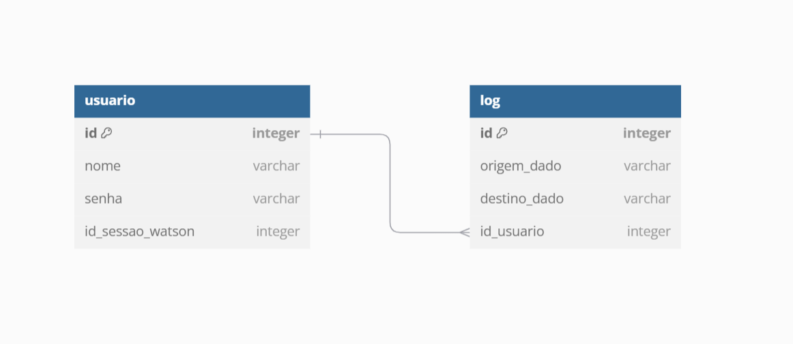

# Banco de Dados

Um banco de dados é uma coleção organizada de informações ou dados estruturados de forma que possam ser facilmente acessados, gerenciados e atualizados. Os bancos de dados são essenciais para armazenar e manipular grandes quantidades de dados em uma variedade de aplicações, desde sistemas de pequenas empresas até plataformas corporativas complexas. [1]

Nesse sentido, existem diferentes tipos de bancos de dados, cada um projetado para atender a necessidades específicas. Assim, temos bancos de dados relacionais, não relacionais, banco de dados orientado a objetos entre outros. 

Neste sentido, foi optado por utilizar um banco de dados relacional, o qual é um tipo de banco de dados que organiza os dados em tabelas, onde os dados são armazenados em linhas e colunas. Cada tabela é uma coleção de registros (linhas), e cada registro contém um conjunto de campos (colunas) que armazenam valores individuais. A estrutura rígida e organizada permite que os dados sejam relacionados entre si de forma lógica, facilitando o acesso, a consulta e a manipulação dos dados. [1]

Nessa perspctiva, foi feito um esquema que determina as conexões que o banco terá, como está presente na Figura 1 - Banco de Dados.

 **
Figura 1 - Arquitetura do banco de dados da solução
**

 **
Fonte: Elaboração própria
**

Na arquitetura do banco de dados ilustrada na Figura 1, observa-se que ele é composto por duas tabelas principais para a sua representação. A primeira tabela, denominada *usuario*, é responsável por armazenar as informações dos usuários que interagem com o sistema. Essa tabela inclui dados como o nome do usuário, sua senha de login e a identificação da sessão do Watson que foi acessada, garantindo a segurança e o controle de acesso ao sistema. 

A segunda tabela, chamada *log*, tem a função de registrar informações sobre a origem e o destino dos dados fornecidos pelos usuários. Nela, são armazenados detalhes sobre o local de partida do robô (de onde os dados foram enviados) e o destino final (o local do hospital para onde o robô deve se dirigir). Essa estrutura possibilita o rastreamento e o monitoramento eficiente das operações realizadas pelo sistema, assegurando a confiabilidade e a transparência no registro das interações e movimentações.

 # Bibliografia:
 [1] ALURA. Banco de Dados: o que é, principais tipos e um guia para iniciar. Alura. Disponível em: [https://www.alura.com.br/artigos/banco-de-dados?srsltid=AfmBOopFSwdq1fKGZJ4zd72prLp3gKhBa94M2838XD6ARvm7m2AJHJQL](https://www.alura.com.br/artigos/banco-de-dados?srsltid=AfmBOopFSwdq1fKGZJ4zd72prLp3gKhBa94M2838XD6ARvm7m2AJHJQL). Acesso em: 16 nov. 2024.

‌
