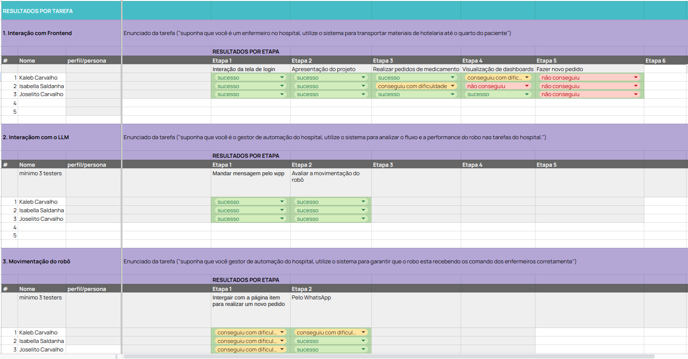

# Validação de eficácia do sistema

A validação de eficácia do sistema é o processo que assegura que um sistema, produto ou solução cumpre os objetivos e requisitos para os quais foi projetado, garantindo que ele entregue os resultados esperados de forma eficiente e confiável em condições reais de uso. Esse processo envolve a definição de critérios de eficácia, nos quais são identificados os objetivos específicos que o sistema deve atingir e estabelecidas métricas claras e mensuráveis para avaliar seu sucesso. Além disso, são realizados testes de funcionalidade para verificar se o sistema funciona conforme planejado, cobrindo todos os requisitos especificados e identificando possíveis falhas que possam comprometer seu desempenho. [1] 

A avaliação em condições reais de uso também é uma etapa essencial, pois permite testar o sistema em cenários que simulem o ambiente em que ele será utilizado, assegurando que ele interaja corretamente com outros sistemas ou usuários. A validação de desempenho é outro aspecto importante, pois confirma que o sistema opera de forma eficiente sob diferentes condições, como alta carga ou situações de falha. O processo também pode incluir a obtenção de feedback de usuários ou stakeholders, garantindo que o sistema atenda às expectativas práticas e seja fácil de usar. Por fim, todos os resultados são documentados de forma detalhada, incluindo casos de sucesso e problemas identificados. [1]

Esse processo traz diversos benefícios, como o aumento da confiança na solução, a redução de riscos ao identificar problemas antes da implantação, a elevação da satisfação do cliente e a garantia de conformidade com normas e regulamentações aplicáveis. A validação de eficácia é especialmente relevante em projetos que envolvem software, dispositivos médicos, sistemas embarcados ou qualquer solução em que a confiabilidade seja essencial. [1]

Nesse sentido, para realizar os testes deste projeto, foi elaborada uma planilha contendo informações dos entrevistados, com o objetivo de avaliar a percepção deles em relação ao sistema desenvolvido. Dessa forma, foram obtidos resultados que contribuíram para a validação da eficácia do sistema, considerando aspectos como a interface frontend, o modelo de linguagem (LLM) e a movimentação do robô.

 **
Imagem 1 - Validação de Eficácia do Sitema 
**

 **
Fonte: Elaboração própria
**

 *obs: para melhor visualização acesse [Link](https://docs.google.com/spreadsheets/d/15RCjiBJfLbzAQfXWcr_DTkKu2pcxRwAVfrXfSzEo9Wc/edit?usp=sharing)

[1] MIRANDA, Bruno. O que é a Validação de Sistemas Computadorizados? - Comprovei. Comprovei - Realize entregas incríveis. Disponível em: [https://comprovei.com/tecnologia/o-que-e-a-validacao-de-sistemas-computadorizados/#:~:text=A%20Valida%C3%A7%C3%A3o%20de%20Sistemas%20Computadorizados%20%C3%A9%20um%20processo%20realizado%20para,%2C%20precisa%2C%20segura%20e%20rastre%C3%A1vel.](https://comprovei.com/tecnologia/o-que-e-a-validacao-de-sistemas-computadorizados/#:~:text=A%20Valida%C3%A7%C3%A3o%20de%20Sistemas%20Computadorizados%20%C3%A9%20um%20processo%20realizado%20para,%2C%20precisa%2C%20segura%20e%20rastre%C3%A1vel.). Acesso em: 18 dez. 2024.

‌