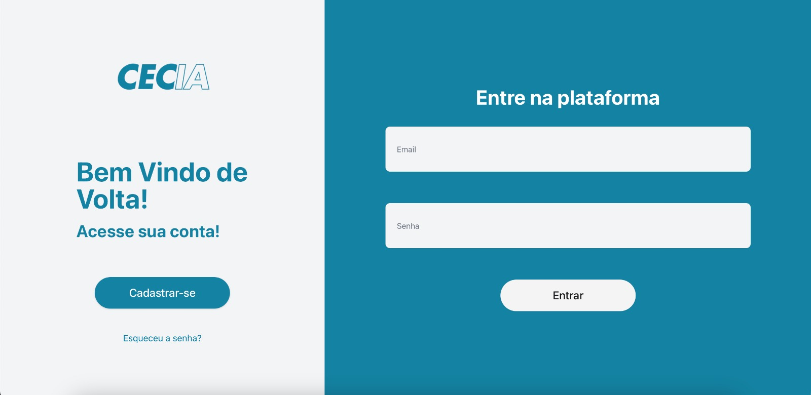
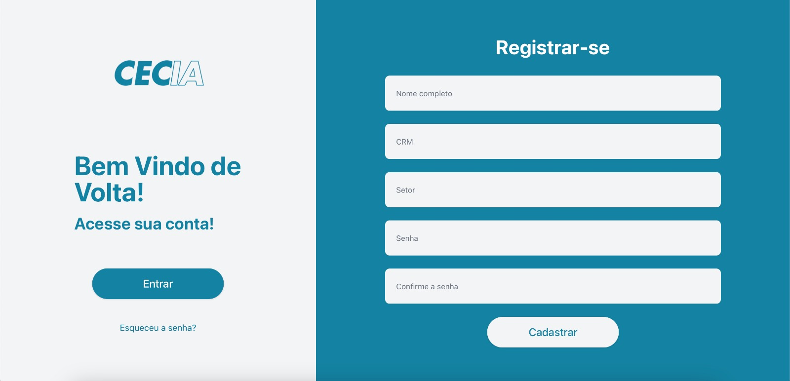
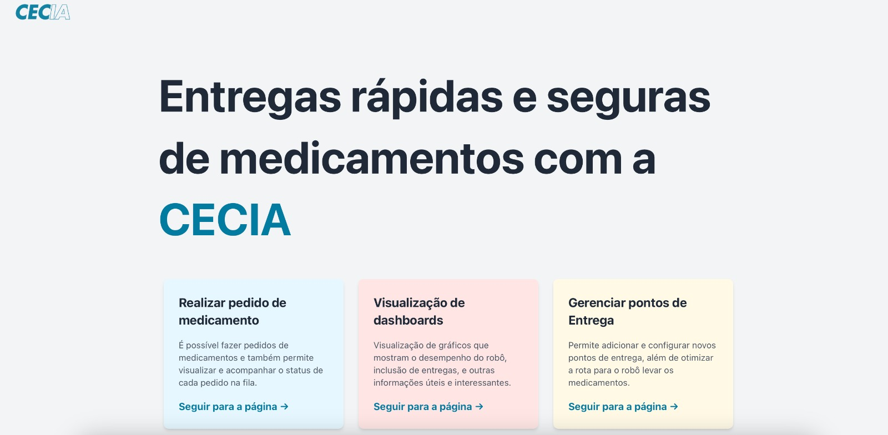
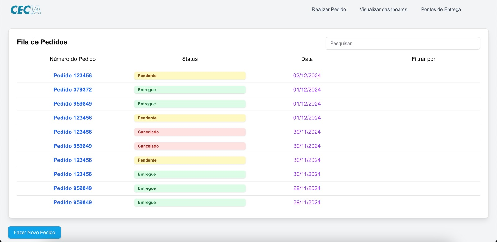
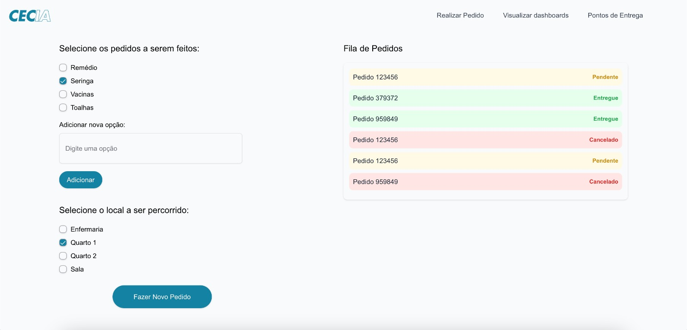

# Interface Frontend

## Imagem 1 - tela de login

A tela de login é composta por duas seções principais. À esquerda, há o logotipo do sistema "CECIA" acompanhado de uma mensagem de boas-vindas com o texto "Bem Vindo de Volta! Acesse sua conta!". Nesta área, também estão presentes o botão "Cadastrar-se" e o link "Esqueceu a senha?" para recuperação de senha. À direita, encontra-se o formulário de login, que contém os campos Email e Senha, além do botão "Entrar" para acessar a plataforma.

## Imagem 2 - tela de registro

A tela de registro segue um layout similar à tela de login, com o logotipo "CECIA" e a mensagem de boas-vindas posicionados à esquerda. Nessa área, há um botão "Entrar" que permite redirecionar o usuário para a tela de login. À direita, é exibido o formulário de cadastro com campos para Nome Completo, CRM, Setor, Senha e Confirmação de Senha. Logo abaixo, há o botão "Cadastrar" para submeter os dados e concluir o processo de registro na plataforma.

## Imagem 3 - tela de menu

A tela de menu principal apresenta uma visão geral das funcionalidades do sistema, dividida em três seções. A primeira seção, "Realizar pedido de medicamento", permite aos usuários fazer solicitações de medicamentos e acompanhar o status de cada pedido. A segunda seção, "Visualização de dashboards", direciona os usuários para uma área onde podem visualizar gráficos que demonstram o desempenho do robô e dados relacionados às entregas. Por fim, a terceira seção, "Gerenciar pontos de entrega", possibilita configurar e adicionar novos locais para otimizar as rotas utilizadas pelo robô. Cada uma dessas seções apresenta um pequeno resumo de sua funcionalidade e um link "Seguir para a página" para acessar os detalhes.

## Imagem 4 - tela de fila de pedidos

A tela de fila de pedidos exibe uma tabela organizada com três colunas principais: Número do Pedido, Status e Data. A coluna "Número do Pedido" apresenta os identificadores únicos para cada solicitação, enquanto a coluna "Status" exibe o progresso do pedido, utilizando cores específicas para facilitar a identificação: verde para Entregue, amarelo para Pendente e vermelho para Cancelado. A última coluna, "Data", informa o dia em que o pedido foi criado ou atualizado. No canto inferior esquerdo, há um botão "Fazer Novo Pedido" para criar novas solicitações. Além disso, no topo da tela, uma barra de pesquisa e opções de filtragem estão disponíveis para facilitar a localização de pedidos específicos.

## Imagem 5 - tela de seleção de pedidos

A tela de seleção de pedido e local é organizada em duas seções principais. À esquerda, os usuários podem selecionar os itens que desejam solicitar, como Remédio, Seringa, Vacinas e Toalhas, além de adicionar novas opções através de um campo de texto e do botão "Adicionar". Abaixo dessa seção, os usuários encontram uma lista com os locais disponíveis, como Enfermaria, Quarto 1, Quarto 2 e Sala, permitindo a seleção do destino desejado. À direita, é exibida a "Fila de Pedidos", que lista os pedidos recentes com status diferenciados por cores, semelhante à tela anterior. Por fim, o botão "Fazer Novo Pedido" está posicionado no canto inferior esquerdo, facilitando a submissão da solicitação.